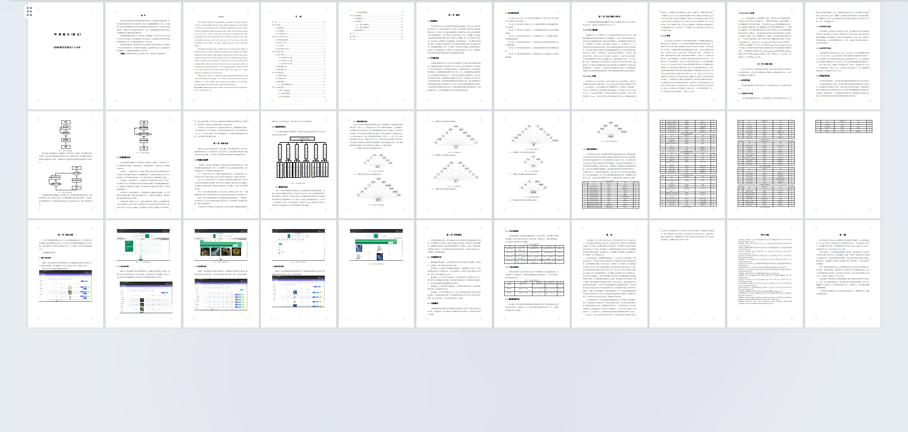
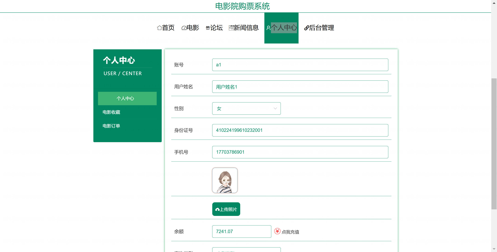
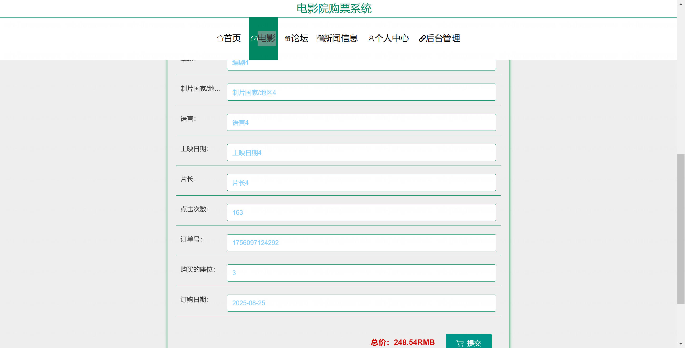
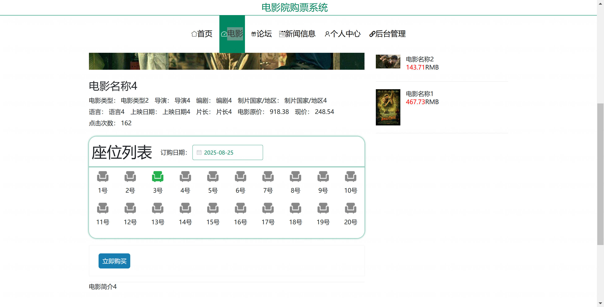
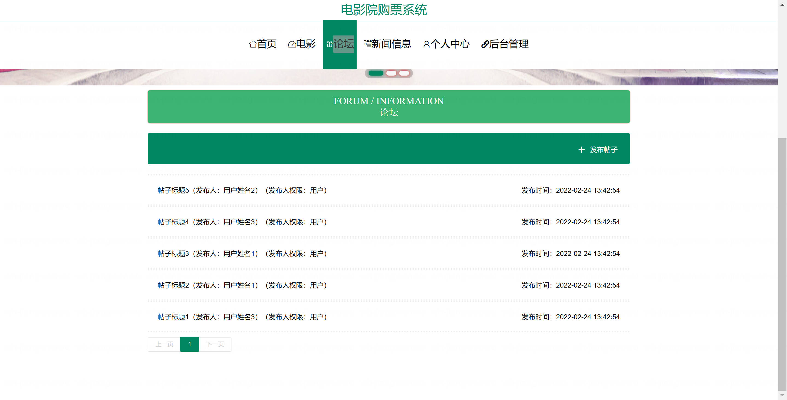
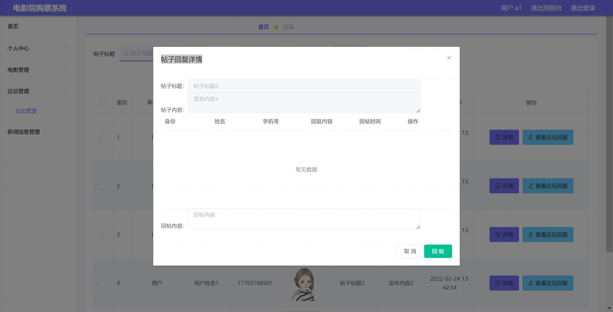

<h1 align="center">基于SpringBoot框架的电影院购票系统【带论文】</h1>

- <b>完整代码获取地址：从戎源码网 ([https://armycodes.com/](https://armycodes.com/))</b>
- <b>技术探讨、资料分享，请加QQ群：692619798</b>
- <b>作者微信：19941326836  QQ：952045282</b>
- <b>承接计算机毕业设计、Java毕业设计、Python毕业设计、深度学习、机器学习</b>
- <b>选题+开题报告+任务书+程序定制+安装调试+论文+答辩ppt 一条龙服务</b>
- <b>所有选题地址 ([https://github.com/Descartes007/allProject](https://github.com/Descartes007/allProject)) </b>

## 一、项目介绍

基于SpringBoot框架的电影院购票系统，系统角色为管理员、用户，主要功能如下
### 管理员：
- 基本操作：登录、修改密码、获取个人信息、修改个人信息、退出登录
- 电影管理：筛选电影、获取电影列表、查看电影详情、新增电影、修改电影信息、删除电影
- 电影订单管理：获取订单列表、查看订单详情、修改订单信息、发货、收货、删除订单
- 电影收藏管理：获取收藏列表、查看收藏详情、删除收藏记录
- 电影评价管理：获取评价列表、查看评价详情、回复评价、删除评价
- 用户管理：筛选用户信息、查看用户详情、新增用户、修改用户信息、删除用户、重置密码
- 后台账户管理：筛选管理员账户、查看账户详情、新增账户、修改账户、删除账户、重置密码
- 论坛管理：获取帖子列表、查看帖子详情、发布帖子、编辑帖子、删除帖子
- 新闻管理：发布新闻、获取新闻列表、查看新闻详情、修改新闻、删除新闻
### 用户：
- 基本操作：登录、注册、修改密码、获取个人信息、修改个人信息、退出登录
- 电影浏览与收藏：浏览电影列表、筛选电影、查看电影详情、收藏电影、取消收藏、查看我的收藏
- 购票下单与支付：选择座位下单、余额支付、查看支付结果
- 订单管理：查看订单列表、查看订单详情、申请退款、查看订单状态
- 评价管理：对已购电影发表评价、查看我的评价
- 论坛互动：发布帖子、浏览帖子、查看帖子详情
- 新闻公告：浏览新闻列表、查看新闻详情

## 二、项目技术

- 编程语言：Java
- 项目架构：B/S架构
- 前端技术：Vue 2、ElementUI、Vue Router、Vuex、Axios
- 后端技术：Spring Boot 2.2、MyBatis-Plus、MyBatis、Fastjson、Hutool、Commons IO、MySQL

## 三、运行环境

- JDK版本：1.8及以上都可以
- 操作系统：Windows7/10、MacOS
- 开发工具：IDEA、Ecplise、MyEclipse都可以

## 四、数据库配置文件

- npm版本：6.14.13及以上都可以
- Redis版本：3.2.100及以上都可以
- 文件名：application.yml
- 编码类型：utf8

## 论文截图

## 系统截图

